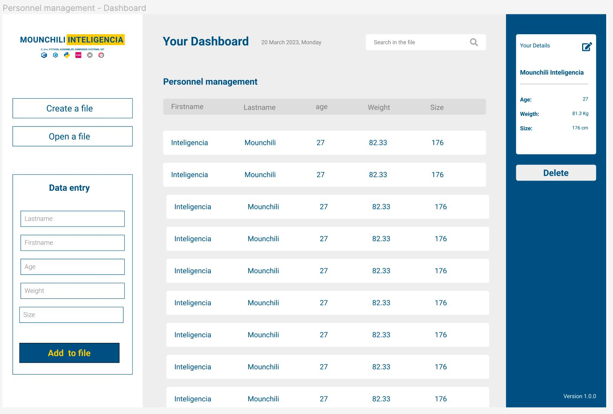

# personnel-managment-dashboard

The objective of this project is to develop a personnel management dashboard for a fictitious company which should store the data of job applicants in a database in an intuitive way and allow easy editing of the data of each person. It should allow filtering of the information contained in the dashboard.



## Project set-up and installation

### Create a project folder

```
mkdir my-projet && cd my-project
```

### Install virtualenv

```
pip install virtualenv
```

### Create and activate the virtual environment - Windows

```
virtualenv env
\env\Scripts\activate
```

### Create and activate the virtual environment - MacOS/Linux

```
virtualenv env
source env/bin/activate
```

### Install PySide6

```
pip install pyside6
```

### Check the PySide version

```python
import PySide6
print(PySide6.__version__)
```

### How to deactivate virtualenv

```
deactivate
```
